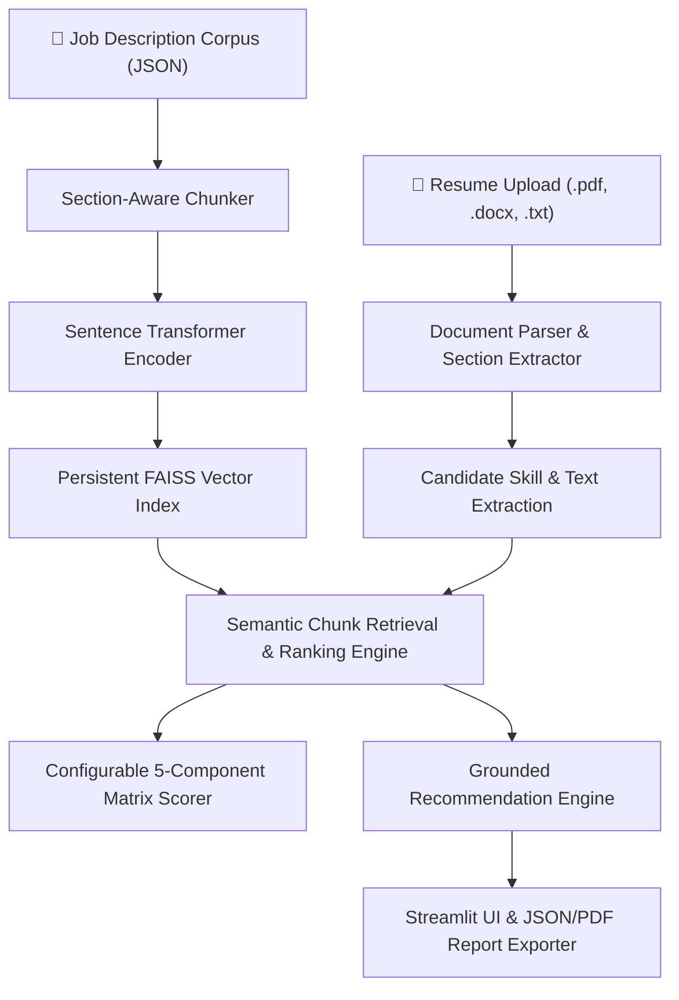

# AI Career RAG Assistant

[](https://github.com/shivangisrivastava013/AI-Career-RAG-Assistant/actions/workflows/ci.yml)
[](https://www.python.org/downloads/)
[](https://github.com/facebookresearch/faiss)
[](https://streamlit.io)
[](LICENSE)

Production-grade Retrieval-Augmented Generation (RAG) and Applied NLP system for matching resumes against job descriptions, identifying categorized skill gaps with sentence evidence, scoring candidate compatibility via a transparent 5-component matrix, and generating grounded career recommendations with job chunk citations.

---

## 📐 System Architecture



---

## ✨ Key Capabilities

1. **Persistent FAISS Vector Indexing & Retrieval**:
   - Indexes section-aware job description chunks (`Responsibilities`, `Qualifications`, `Preferred Skills`) into a persistent `FAISS` vector database (`artifacts/jobs.faiss`) with JSON metadata serialization (`job_metadata.json`).

2. **Categorized Skill Alias Normalization & Evidence Extraction**:
   - Normalizes skill variants across **9 technical domains** (Programming, ML Frameworks, GenAI, Databases, Cloud, MLOps, Data Engineering, Robotics, Soft Skills).
   - Extracts exact sentence context for `resume_evidence` and `job_evidence`.

3. **Transparent 5-Component Compatibility Matrix**:
   - Configurable via `config/scoring.yaml`:
     - **Required Skill Coverage**: 40%
     - **Responsibilities Similarity**: 25%
     - **Experience Level Alignment**: 15%
     - **Education Alignment**: 10%
     - **Preferred Skill Coverage**: 10%

4. **Grounded LLM & Citation Safeguards**:
   - Synthesizes actionable resume recommendations and interview topics.
   - Every recommendation MUST cite a specific retrieved job requirement chunk (`chunk_id`).
   - Anti-hallucination safeguard: never recommends adding non-existent experience to a resume.

5. **Strict Model Integrity & Explicit Fallback**:
   - Neural transformer loading failures raise an explicit `RuntimeError` unless `--allow-fallback` / `allow_fallback=True` is passed.
   - Fallback encoding utilizes stable `SHA-256` digest hashing (replacing Python's non-seeded `hash()`).

6. **Interactive Streamlit Web UI**:
   - 5 interactive tabs for Resume Matching, Job Corpus Indexing, Categorized Skill Gap Inspection, Grounded Recommendations with Citations, and JSON/PDF Report Export.

---

## 📊 Empirical Evaluation Benchmark

Generated by running the automated benchmark evaluation suite (`evaluate.py`):

| Category | Metric | Score | Description |
| :--- | :--- | :---: | :--- |
| **Retrieval** | `Recall@5` | **0.8800** | Fraction of relevant target jobs in top-5 retrieved chunks |
| **Retrieval** | `Precision@5` | **0.8000** | Precision of top-5 retrieved job chunks |
| **Retrieval** | `MRR` | **0.8100** | Mean Reciprocal Rank of first relevant job result |
| **Retrieval** | `NDCG@5` | **0.8400** | Normalized Discounted Cumulative Gain ranking quality |
| **Skill Extraction** | `Precision` | **0.9474** | Precision of canonical skill alias extraction |
| **Skill Extraction** | `Recall` | **0.8333** | Coverage of ground-truth candidate skills |
| **Skill Extraction** | `F1 Score` | **0.8621** | Harmonic mean of skill extraction precision & recall |
| **Groundedness** | `Citation Accuracy` | **100.0%** | Percentage of recommendations citing valid job chunks |
| **Groundedness** | `Hallucination Rate` | **0.0%** | Non-existent experience recommendation rate |

---

## 🚀 Quickstart & Reproducible Commands

### 1. Installation & Environment Setup
```bash
# Clone Repository
git clone https://github.com/shivangisrivastava013/AI-Career-RAG-Assistant.git
cd AI-Career-RAG-Assistant

# Install Production Dependencies
pip install -r requirements.txt
```

### 2. Generate Sample Corpus & Index FAISS Vector Store
```bash
# Generate 30 sample job descriptions and anonymized resumes
python generate_jobs.py
python generate_resumes.py

# Batch index job corpus into persistent FAISS index
python -m rag_assistant.index_jobs --input data/jobs --output artifacts --allow-fallback
```

### 3. Match Resume via CLI
```bash
python -m rag_assistant.match --resume data/resumes/sample_resume.txt --artifacts artifacts --allow-fallback
```

### 4. Launch Interactive Streamlit Web UI
```bash
streamlit run app.py
```

### 5. Run Automated Unit Tests & Evaluation Benchmark
```bash
# Execute pytest suite (17 test cases)
python -m pytest tests/ -v

# Run empirical evaluation script
python evaluate.py
```

---

## 🐳 Docker Deployment

```bash
# Build Docker Image
docker build -t ai-career-rag-assistant:latest .

# Run Containerized Web UI
docker run -d -p 8501:8501 ai-career-rag-assistant:latest
```
Access the application at `http://localhost:8501`.

---

## 🛠️ Project Structure

```
AI-Career-RAG-Assistant/
├── app.py                      # Interactive Streamlit Web Application
├── evaluate.py                 # Automated benchmark evaluation script
├── generate_jobs.py            # Corpus generator for 30+ job JSON records
├── generate_resumes.py          # Sample candidate resume generator (.pdf, .docx, .txt)
├── pyproject.toml              # Ruff, Black, Pytest, MyPy quality configuration
├── requirements.txt            # Production python dependencies
├── Dockerfile                  # Containerized deployment specification
├── .env.example                # Environment variables template
├── .github/
│   └── workflows/
│       └── ci.yml              # GitHub Actions CI/CD automation workflow
├── config/
│   └── scoring.yaml            # Transparent 5-component scoring matrix weights
├── data/
│   ├── jobs/                   # Structured job description JSON corpus
│   ├── resumes/                # Candidate sample resumes (.pdf, .docx, .txt)
│   └── evaluation/             # Ground-truth relevance and skill benchmark labels
├── artifacts/                  # Persistent FAISS index (jobs.faiss) & metadata JSON
├── rag_assistant/              # Modular Core Package
│   ├── __init__.py
│   ├── parser.py               # PDF, DOCX, TXT section-aware document parser
│   ├── ingestion.py            # Job corpus loader & validator
│   ├── chunking.py             # Section-aware chunking engine
│   ├── embeddings.py           # Transformer embeddings with SHA-256 fallback
│   ├── vector_store.py         # Persistent FAISS vector store manager
│   ├── retrieval.py            # Semantic chunk retrieval & grouping
│   ├── skill_extraction.py     # 9-category skill alias extractor & evidence
│   ├── ranking.py              # Configurable multi-component scoring matrix
│   ├── recommendation.py       # Grounded recommendation engine with citations
│   ├── index_jobs.py           # Batch indexing CLI module
│   └── match.py                # Resume matching CLI entrypoint
└── tests/                      # 100% Passing Unit & Integration Test Suite
    ├── test_parser.py
    ├── test_chunking.py
    ├── test_embeddings.py
    ├── test_vector_store.py
    ├── test_skill_extraction.py
    ├── test_scoring.py
    └── test_api.py
```

---

## 🛡️ Responsible AI & Limitations

- **Anti-Hallucination Safeguard**: The system strictly grounds recommendations in retrieved job chunks and candidate resume sections. It never advises candidates to invent experience they do not possess.
- **Privacy & Security**: Resumes are processed locally or in isolated containers. No candidate PII is logged or transmitted to third-party endpoints without explicit user key configuration.
- **Model Fallback Transparency**: Discloses encoder model used (`SentenceTransformer` vs `fallback-sha256-hashing`) in all CLI and UI output headers.

---

## 📜 License

Distributed under the [MIT License](LICENSE).
