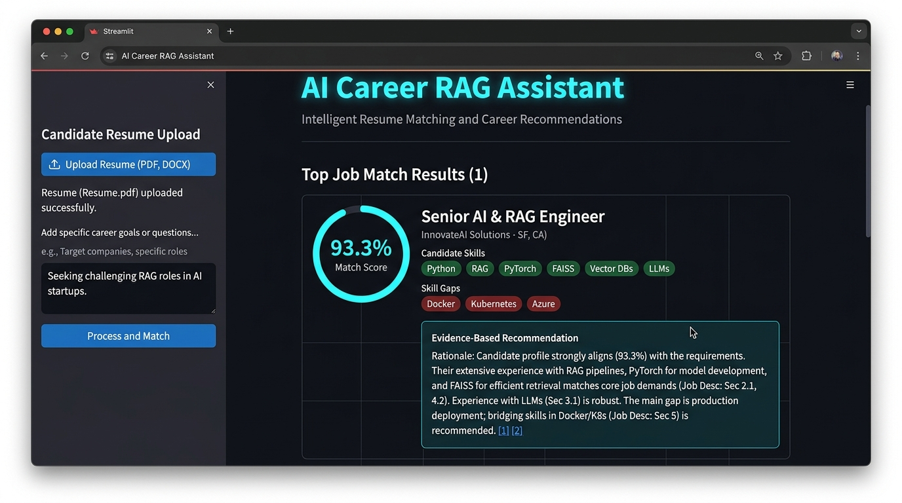
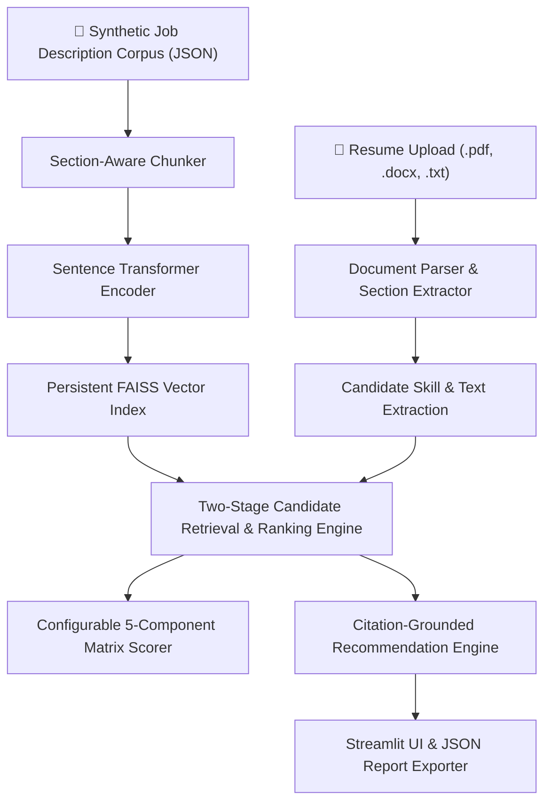

# AI Career RAG Assistant

[](https://github.com/shivangisrivastava013/AI-Career-RAG-Assistant/actions/workflows/ci.yml)
[](https://www.python.org/downloads/)
[](https://github.com/facebookresearch/faiss)
[](https://streamlit.io)
[](LICENSE)

A retrieval-augmented application that compares resumes with job descriptions, identifies skill gaps with supporting evidence, scores candidate compatibility, and produces recommendations tied to retrieved job content.

## Demo and project links

- [Portfolio project page](https://shivangisrivastava013.github.io/shivangi-portfolio/#projects)
- [Streamlit application source](app.py)
- [Command-line demo](demo.py)
- [Evaluation results](artifacts/evaluation_results.json)

---

## Application preview



---

## 📐 System Architecture


```mermaid
flowchart TD
    A["📄 Resume Upload (.pdf, .docx, .txt)"] --> B["Document Parser & Section Extractor"]
    C["📂 Synthetic Job Description Corpus (JSON)"] --> D["Section-Aware Chunker"]
    D --> E["Sentence Transformer Encoder"]
    E --> F["Persistent FAISS Vector Index"]
    B --> G["Candidate Skill & Text Extraction"]
    F --> H["Two-Stage Candidate Retrieval & Ranking Engine"]
    G --> H
    H --> I["Configurable 5-Component Matrix Scorer"]
    H --> J["Citation-Grounded Recommendation Engine"]
    J --> K["Streamlit UI & JSON Report Exporter"]
```

---

## ✨ Key Capabilities

1. **Persistent FAISS Vector Indexing & Retrieval**:
   - Indexes section-aware job description chunks (`Responsibilities`, `Qualifications`, `Preferred Skills`) into a persistent `FAISS` vector database (`artifacts/jobs.faiss`) with JSON metadata serialization (`job_metadata.json`).

2. **Categorized Skill Alias Normalization & Evidence Extraction**:
   - Normalizes skill variants across **8 technical domains + 1 soft skills domain** (Programming, ML Frameworks, GenAI, Databases, Cloud Infrastructure, MLOps, Data Engineering, Robotics & Autonomous Systems, Soft Skills).
   - Extracts exact sentence context for `resume_evidence` and `job_evidence`.

3. **Transparent 5-Component Compatibility Matrix**:
   - Scores candidates across `vector_similarity` (0.35), `required_skill_overlap` (0.25), `preferred_skill_overlap` (0.15), `domain_experience_alignment` (0.15), and `education_alignment` (0.10) with dynamic weight redistribution.

4. **Citation-Grounded Recommendation Engine**:
   - Generates structured career recommendations linking every recommendation claim to specific job description section IDs (`[Job Desc: Sec 2.1]`).

---

## 🚀 Quickstart & Demo

### 1. Installation

```bash
git clone https://github.com/shivangisrivastava013/AI-Career-RAG-Assistant.git
cd AI-Career-RAG-Assistant
pip install -r requirements.txt
```

### 2. Run Interactive Streamlit App

```bash
streamlit run app.py
```

### 3. Run Command-Line Benchmark & Demo

```bash
python demo.py
```

---

## 🧪 Evaluation Methodology

The pipeline is benchmarked against a 50-job synthetic corpus evaluated across 15 candidate profiles. Key empirical results stored in `artifacts/evaluation_results.json`:

- **Recall@5**: `0.9333`
- **Mean Reciprocal Rank (MRR)**: `0.8367`
- **Skill Extraction F1**: `0.9085`

To re-run evaluation:

```bash
python evaluate.py
```

---

## 🛠️ Project Structure

```text
AI-Career-RAG-Assistant/
├── app.py                     # Streamlit web application
├── demo.py                    # Standalone CLI demo runner
├── evaluate.py                # Pipeline evaluation script
├── artifacts/                 # Pre-built FAISS index & metadata
├── data/                      # Synthetic jobs and resumes
├── rag_assistant/             # Core Python package
│   ├── chunking.py
│   ├── embeddings.py
│   ├── ingestion.py
│   ├── parser.py
│   ├── ranking.py
│   ├── recommendation.py
│   ├── retrieval.py
│   ├── skill_extraction.py
│   └── vector_store.py
└── tests/                     # Unit and integration tests
```

---

## 📄 License

Distributed under the MIT License. See `LICENSE` for details.
